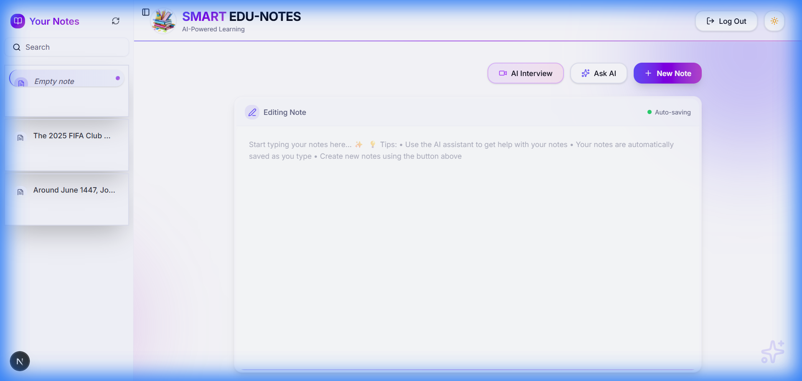

# Smart Edu-Notes | AI-Powered Learning Companion



Smart Edu-Notes is a modern, high-performance note-taking application designed to enhance your learning experience through AI integration. Built with Next.js 15, it combines a premium user interface with powerful AI capabilities to help you organize study materials, prepare for interviews, and interact with your notes intelligently.

## 🚀 Key Features

- **✨ AI-Powered Interactions**: Ask questions directly to your notes and get intelligent summaries or explanations.
- **🎙️ AI Meeting & Voice**: Advanced voice services for a more interactive learning experience.
- **💡 AI Interview Preparation**: Transform your notes into interactive interview questions to test your knowledge.
- **⚡ Real-time Auto-save**: Never lose your work with seamless background saving.
- **📱 Responsive & Premium UI**: A beautiful, dark-mode-ready interface built for focus and productivity.
- **🔍 Smart Search**: Instantly find any note with powerful fuzzy search.

## 🛠️ Tech Stack

- **Framework**: Next.js 15 (App Router)
- **Language**: TypeScript
- **Database**: PostgreSQL (via Prisma ORM)
- **Authentication**: Supabase Auth
- **AI Engines**: Google Gemini & Cerebras AI
- **Styling**: Tailwind CSS & Lucide Icons
- **Components**: Radix UI & Shadcn UI

## 📋 Getting Started

### Prerequisites

- Node.js (Latest LTS)
- A PostgreSQL database (e.g., Supabase)
- API Keys for Google Gemini and Cerebras AI

### Installation

1. Clone the repository:
   ```bash
   git clone https://github.com/shahsuraj0204/smart-edu-notes.git
   cd smart-edu-notes
   ```

2. Install dependencies:
   ```bash
   npm install
   ```

3. Configure Environment Variables:
   Create a `.env.local` file in the root directory and add the following:
   ```env
   NEXT_PUBLIC_SUPABASE_URL=your_supabase_url
   NEXT_PUBLIC_SUPABASE_ANON_KEY=your_supabase_anon_key
   DATABASE_URL=your_postgresql_url
   GEMINI_API_KEY=your_gemini_api_key
   CEREBRAS_API_KEY=your_cerebras_api_key
   NEXT_PUBLIC_BASE_URL=http://localhost:3000
   ```

4. Initialize the Database:
   ```bash
   npx prisma generate
   npx prisma db push
   ```

5. Run the development server:
   ```bash
   npm run dev
   ```

## 📄 License

This project is licensed under the MIT License - see the LICENSE file for details.

---
Created with ❤️ by [Suraj Shah](https://github.com/shahsuraj0204)
